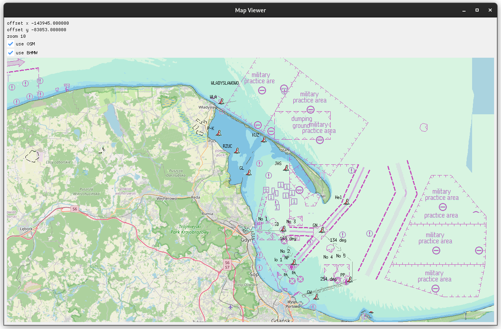

# Map Viewer for OSM and BHMW

- asynchronous tile downloading
- tile caching
- support for [Open Street Map](https://www.openstreetmap.org/#map=7/52.018/19.137)
- support for [Biuro Hydrograficzne Marynarki Wojennej](https://bhmw-wms.wp.mil.pl/)



### Dependencies

```bash
sudo apt install -y \
    make \
    cmake \
    libopengl-dev \
    libglfw3-dev \
    libcurl4-openssl-dev \
    libstb-dev
```

### Build

```bash
mkdir -p build
cd build
cmake ..
make
./map_viewer
```
